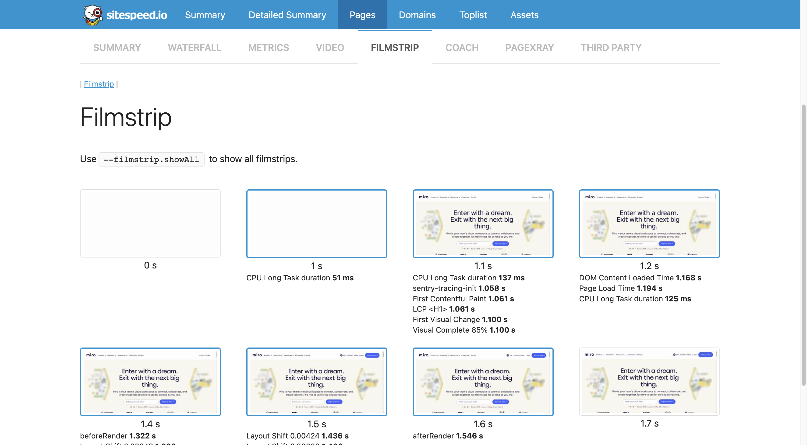

<!-- _class: lead
-->

# __SiteSpeed.io__ для тестов

##  производительности

### Смирнов Вячеслав, Miro

<!--
_footer: `Images by Vlad Gerasimov on https://vlad.studio/`
 -->

 ---
<!-- _class: title -->

# Ускоряю  Miro
## Развиваю  @qa_load


---
### 1. Почему SiteSpeed хорош
## 2. Запустим простой тест
## 3. Переопределим параметры
## 4. Демонстрация

## 5. Обсудим вопросы из  @perfconfbot

---

<!-- _class: main -->

# Часто начинают нагрузку с __API__, и уже потом смотрят на __Web__

---

<!-- _class: main  -->

# Больших компаний мало. Небольших компаний много, и им нужны __FullStack__-и

---

<!-- _class: main  -->

# __Тестовый стенд__, данные и их поддержка — сложнейшие задачи в нагрузке

---

<!-- _class: main solution -->

# SiteSpeed


---


<!-- _class: main error -->

## Это не решит всех проблем 

#  __Но это хороший мониторинг__


---


<!-- _class: main error -->

## Это внедрялось пол года

#  __Но я поделюсь наработками для более быстрого старта__


---

<!-- _class: main problem -->

# Как начать заниматься тестами __производительности__, имея опыт с __Selenium__?

---

<!-- _class: main solution -->

# Заняться клиентской производительностью


---

<!-- _class: main problem -->

# Как двигаться в сторону __FullStack Performance Engineer__, имея опыт нагрузки API?

---

<!-- _class: main solution -->

# Заняться клиентской производительностью


---

<!-- _class: main problem -->

# Как тестировать производительность __без тестового стенда__?

---

<!-- _class: main2 solution -->

# ~~Тестировать~~ на продуктиве, __мониторить__ продуктив

## Без особых тестовых данных
---

<!-- _class: main problem -->

# С каких тестов __продуктива__ проще всего начать?

---

<!-- _class: main2 solution -->

# С читающих тестов с минимальной нагрузкой
## __C главной страницы__

---

<!-- _class: main problem -->

# Какие есть __инструменты__ для тестов клиентской производительности?

---

## Основной инструмент

- __Developer Tools__ браузера

## Рекомендации по оптимизации

- LightHouse
- pagespeed.web.dev

## Веб-сервисы
- WebPageTest.org
- pagespeed.compare
- treo.sh
- ...

---

# Фреймворк автоматизации __Sitespeed__.__io__

- все метрики, как из __Developer tools__

- встроенный плагин __LightHouse__
- настройки и запись видео, как в __WebPageTest__
- возможность сравнения, как в __pagespeed.compare__
- визуалиация трендов, как в __treo.sh__
- поддержка кастомных метрик
- OpenSource
- запускается локально как __Developer tools__, __LightHouse__, __WebPageTest__ (local), ...

---

<!-- _class: main solution -->

# __Sitespeed__.__io__ это все инструменты вместе


---

<!-- _class: main problem -->

# Какие __типы тестов__ можно выполнить?

---

<!-- _class: main2  -->

# __Первое__ открытие страницы, __повторное__ открытие страницы, в __Chrome__, __Mozilla__, __Edge__, __Safari__, __эмулируя__ мобильный браузер, c __Selenium__-скриптом, ...

---


## 1. Почему SiteSpeed хорош
### 2. Запустим простой тест
## 3. Переопределим параметры
## 4. Демонстрация

## 5. Обсудим вопросы из  @perfconfbot

---

<!-- _class: main problem -->

# Как сделать тест с настройками __по умолчанию__ в __sitespeed.io__ через __Docker__?

---

# Запуск теста с параметрами по умолчанию

```bash
docker run \
  --shm-size=1g \
  --rm \
  -v "$(pwd)/sitespeed.io:/sitespeed.io" \
  sitespeedio/sitespeed.io:29.5.0-plus1 \
  --verbose \
  --slug "miro" \
  --urlAlias "miro" \
  "https://miro.com"
```

---

# Увеличиваем память, чтобы браузер не завис

```sh
docker run \
```
```bash
  --shm-size=1g \
```
```sh
  --rm \
  -v "$(pwd)/sitespeed.io:/sitespeed.io" \
  sitespeedio/sitespeed.io:29.5.0-plus1 \
  --verbose \
  --slug "miro" \
  --urlAlias "miro" \
  "https://miro.com"
```

---

# Задаем каталог отчета

```sh
docker run \
  --shm-size=1g \
  --rm \
```
```bash
  -v "$(pwd)/sitespeed.io:/sitespeed.io" \
```
```sh
  sitespeedio/sitespeed.io:29.5.0-plus1 \
  --verbose \
```
```bash
  --slug "miro" \
```
```sh
  --urlAlias "miro" \
  "https://miro.com"
```

#### Каталог (__-v__) и подкаталог (__--slug__): 
```bash
$(pwd)/sitespeed.io/miro/{date}
```

---

# Указываем имя и адрес страницы

```sh
docker run \
  --shm-size=1g \
  --rm \
  -v "$(pwd)/sitespeed.io:/sitespeed.io" \
  sitespeedio/sitespeed.io:29.5.0-plus1 \
  --verbose \
  --slug "miro" \
```
```bash
  --urlAlias "miro" \
  "https://miro.com"
```


---
<!-- _class: main solution -->

# Базовая настройка инструмента __очень проста__


---

<!-- _class: main problem -->

# Что делает docker-тест с настройками по умолчанию __(для версии 29.5.0-plus1)__?

---

# Параметры по умолчанию SiteSpeed

## Cache: __Off__
## Display: __1366x708__
## Browser: __Chromium 107__ (arm), __Chrome 116__ (Intel)
## Iterations: __3__
## Timeout (selenium): __120__ sec


---
<!-- _class: main2 invert -->


---


---




---

<!-- _class: main  -->

# Метрик и данных в отчете __очень много__

---


## 1. Почему SiteSpeed хорош
## 2. Запустим простой тест
### 3. Переопределим параметры
## 4. Демонстрация

## 5. Обсудим вопросы из  @perfconfbot

---

<!-- _class: main problem -->

# Как узнать настройки __по умолчанию__?

---

<!-- _class: main2  -->

#  Поиском в документации по __default__


---


---

<!-- _class: main2 error -->

#  Поиском в документации по __default__

## Так отображаются не все настройки


---

<!-- _class: main2 -->

# Запустить тест с __verbose__ логами 

---

# Ключ __`--verbose`__

```sh
docker run \
  --shm-size=1g \
  --rm \
  -v "$(pwd)/sitespeed.io:/sitespeed.io" \
  sitespeedio/sitespeed.io:29.5.0-plus1 \
```
```bash
  --verbose \
```
```sh
  --slug "miro" \
  --urlAlias "miro" \
  "https://miro.com"
```


Настройки по умолчанию из Verbose-логов:
https://gist.github.com/polarnik/48d3dabd8119d694f0bae2a879d100f8


---

# Увидим параметры запуска __sitespeedio__, __576__ строк

```json
{
  ...,
  "browsertime": {
    "docker": "true",
    "xvfb": true,
    "browser": "chrome",
    "iterations": 3,
    "xvfbParams": {
      "display": 99
    },
    ...,
  },
  ...,
  "maxLoadTime": 120000,
  "max-load-time": 120000,
  "pageCompleteWaitTime": 5000,
  "page-complete-wait-time": 5000,
  ...,
}
```

---

# Увидим результирующий конфиг __browsertime__, __172__ строки
```json
{
  "scripts": [],
  "iterations": 3,
  "delay": 0,
  "videoParams": {
    "framerate": 30,
    "crf": 23,
    "addTimer": true,
    "convert": true,
    "keepOriginalVideo": false,
    "filmstripFullSize": false,
    "filmstripQuality": 75,
    "createFilmstrip": true,
    "thumbsize": 400
  },
  ...,
}
```

---

# Увидим результирующий конфиг __Selenium__, __53__ строки

```json
{
  "map_": {},
  "options_": {
    "prefs": {
      "profile.password_manager_enable": false,
      "profile.default_content_setting_values.notifications": 2,
      "credentials_enable_service": false
    },
    "args": [
      "--no-sandbox",
      "--disable-setuid-sandbox",
      "--disable-gpu",
      "--window-position=0,0",
      "--window-size=1366,708",
      ...,
    ],
  }
}
```

---

# Увидим результирующий конфиг __lighthouse__, __28__ строк

```json
{
  "extends": "lighthouse:default",
  "settings": {
    "maxWaitForFcp": 15000,
    "maxWaitForLoad": 35000,
    "formFactor": "desktop",
    "throttling": {
      "rttMs": 40,
      "throughputKbps": 10240,
      "cpuSlowdownMultiplier": 1,
      "requestLatencyMs": 0,
      "downloadThroughputKbps": 0,
      "uploadThroughputKbps": 0
    },
    "screenEmulation": {
      "mobile": false,
      ...
    },
    ...,
  }
}
```


---

<!-- _class: main solution -->

## __576__ + __172__ + __53__ + __28__ + __...__ = __829__

# Параметров по умолчанию __очень много__

---

<!-- _class: main2 error -->

# Запустить тест с __verbose__ логами 

## Так отображаются лишние настройки

---

<!-- _class: main solution -->

# Узнать параметры по умолчанию можно комбинируя информацию из документации и verbose-логов

---

<!-- _class: main problem  -->

# Как протестировать повторное открытие страницы?


---

<!-- _class: main2 invert -->


# Total requests = __109__
## Без кеша метрики для 3-х итераций одинаковые

---


---

# Запуск теста с кешированием

```bash
docker run \
  --shm-size=1g \
  --rm \
  -v "$(pwd)/sitespeed.io:/sitespeed.io" \
  -v "$(pwd)/chrome-user-data-dir:/tmp/chrome-user-data-dir" \
  sitespeedio/sitespeed.io:29.5.0-plus1 \
  --verbose \
  --slug "miro" \
  --urlAlias "miro" \
  --chrome.args "user-data-dir=/tmp/chrome-user-data-dir" \
  "https://miro.com"
```

---

# Добавляем каталог для профиля браузера

```sh
docker run \
  --shm-size=1g \
  --rm \
  -v "$(pwd)/sitespeed.io:/sitespeed.io" \
```
```bash
  -v "$(pwd)/chrome-user-data-dir:/tmp/chrome-user-data-dir" \
```
```sh
  sitespeedio/sitespeed.io:29.5.0-plus1 \
  --verbose \
  --slug "miro" \
  --urlAlias "miro" \
  --chrome.args "user-data-dir=/tmp/chrome-user-data-dir" \
  "https://miro.com"
```

---

# Указываем браузеру путь к каталогу профиля

```sh
docker run \
  --shm-size=1g \
  --rm \
  -v "$(pwd)/sitespeed.io:/sitespeed.io" \
  -v "$(pwd)/chrome-user-data-dir:/tmp/chrome-user-data-dir" \
  sitespeedio/sitespeed.io:29.5.0-plus1 \
  --verbose \
  --slug "miro" \
  --urlAlias "miro" \
```
```bash
  --chrome.args "user-data-dir=/tmp/chrome-user-data-dir" \
```
```sh
  "https://miro.com"
```

---
<!-- _class: main2 invert -->

# __103__ requests на __1__-й итерации


---
<!-- _class: main2 invert -->

# __12__ requests на __2__ и __3__

## Кеширует!


---

<!-- _class: main2 problem -->

# Как сделать __все__ итерации теста __с кешированием__?

## Три итерации по __12__ requests


---

<!-- _class: main2 solution -->

# Сделать __два__ теста с общим каталогом __user-data-dir__

## Первый тест прогреет, второй тест будет с кешированием

---

<!-- _class: main -->

# Программирование для SiteSpeed это много конфигурирования SiteSpeed и программирования вокруг него

---

## 1. Почему SiteSpeed хорош
## 2. Запустим простой тест
## 3. Переопределим параметры
### 4. Демонстрация

## 5. Обсудим вопросы из  @perfconfbot

---

- Как включить __кеш__ браузера __firefox__?
- Как выполнить __первое__ и __повторное__ открытие страницы?
- Как выполнить __первое__ и __повторное__ открытие страницы в __одном__ тесте?
- Как выполнить __первое__ и __повторное__ открытие страницы в __разных__ тестах?
- Как включить трассировку запросов бекенда (__Jaeger__, __Zipkin__, __OpenTelemetry__)?
- Как включить сохранение кастомных метрик фронтенда (__User timing API__)?
- Как сохранить __HTML-отчет__ в заданный каталог?
- Как выполнить аутентификацию (__Selenium script__) перед тестом?
- Как отправить метрики в __Graphite__?
- Как визуализировать __Graphite__ метрики по __SiteSpeed.io__ в __Grafana__?
- Как отправить метрики в __InfluxDB__?
- Как визуализировать __InfluxDB__ метрики по __SiteSpeed.io__ в __Grafana__?
- Как отправить метрики в __VictoriaMetrics__?
- Как визуализировать __VictoriaMetrics__ метрики по __SiteSpeed.io__ в __Grafana__?

---

- Что показывает __Performance Score__?
- Как отсортировать результаты по __Performance Score__?
- Что показывает __Speed Index__?
- Как отсортировать результаты по __Speed Index__?
- Что показывает __First Content Paint__ (__FCP__)?
- Что показывает __Largest Content Paint__ (__LCP__)?
- Что показывают __Total Blocking Time__ (__TBT__) и CPU: __RunMicrotasks__?
- Что показывает __Request Count__ ?
- Как включить плагин __Lighthouse__?
- Что показывает отчет __Lighthouse__?
- Какие настройки сохранения __HAR__-файла __browsertime.har__ есть в __Sitespeed.io__?
- Как можно анализировать __HAR__-файл ?
- Какие настройки  __Netlog__-файла __chromeNetlog-1.json.gz__ есть в __Sitespeed.io__?
- Как можно анализировать __Netlog__-файл?
- Какие настройки __Perflog__-файла __chromePerflog-1.json.gz__ есть в __Sitespeed.io__?
- Как можно анализировать __Perflog__-файл?

---


<!--
_footer: `Image from https://ru.pinterest.com/pin/194710383877328824/`

 -->

---

<!-- _class: main2   -->

# qaload.grafana.net

## `owaspviewer`

---

<!-- _class: main error  -->

## Ограничения по внедрению

# __SiteSpeed__.__io__ хорошо подходит для __быстрых__ систем похожих на __wikipedia__.__org__

---


<!--
_footer: `Image from commons.wikimedia.org/wiki/File:KHThisIsFine.jpg`

 -->

---

<!-- _class: main2  -->

# Нет возможности нагружать?

## __Мониторьте через SiteSpeed__

---

<!-- _class: main2  -->

# Нет инфраструктуры мониторинга?

## __Используйте Github и Grafana__

---


<!-- _class: main2  -->

# Не знаете с чего начать?

## github.com/polarnik / __sitespeed.automation__

---

<!-- _class: main problem -->

# Стало интересно?

---
<!-- _class: solution -->

# Используйте __sitespeed__.__io__
# Пишите в  

- @__qa_load__
- @__smirnovqa__

# Примеры

- github.com/polarnik/__sitespeed.automation__
- github.com/wikimedia/__performance-synthetic-monitoring-tests__
- github.com/wikimedia/__performance-mobile-synthetic-monitoring-tests__

# Фоны и слайды
- vlad.studio
- polarnik.github.io/sitespeed.automation


