<!-- _class: lead
-->

# Автотесты 

## производительности __Web__

### Смирнов Вячеслав, Miro

<!--
_footer: `Images by Vlad Gerasimov on https://vlad.studio/`
 -->

---

<!-- _class: main  -->

# Увидеть метрики производительности Web-а __несложно__

---

<!-- _class: main2 -->

# Ручное тестирование 

## __с секундомером__

---

# А еще у нас есть инструменты __автоматизации__

- __Web Developer Tools__ (Google Chrome, Mozilla Firefox, ...)

- __PageSpeed Insights__, 🔗 `pagespeed.web.dev`
- __Pagespeed Compare__, 🔗 `pagespeed.compare`
- __WebPageTest__, 🔗 `webpagetest.org`
- __LightHouse__, 🔗 `github.com/GoogleChrome/lighthouse`
- __SiteSpeed__, 🔗 `sitespeed.io`
- __Treo__, 🔗 `treo.sh`

---

<!-- _class: main2 problem -->

# А какие значения метрик __хорошие__? Как __оценить__ значения метрик?

## __Автоматически__

---

<!-- _class: main problem -->

# Как написать __автотесты__ на оценку метрик, выдаваемых инструментами?

---

<!-- _class: title -->

# Ускоряю  Miro
## Развиваю  @qa_load
### Автоматизирую нагрузку

---

<!-- _class: main2 -->

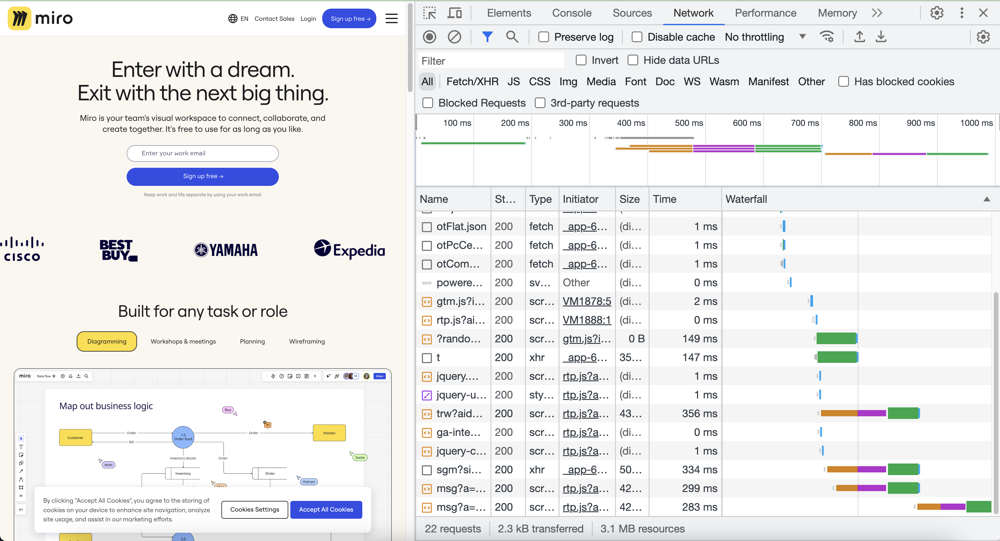

## __Автоматизированный тест__

---

<!-- _class: main2 -->

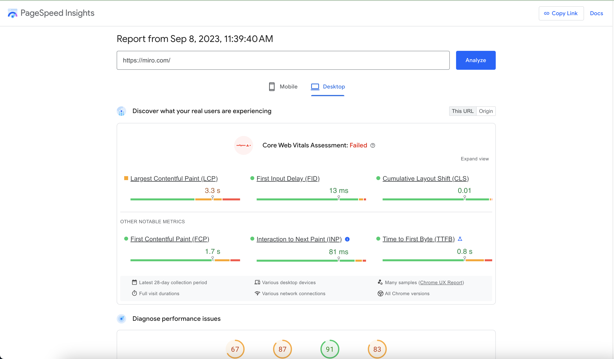

## __с инструментом, выдающим отчеты__

---

<!-- _class: main2 -->

## __которые надо просматривать__

---

<!-- _class: main problem -->

# Как сделать полностью __автоматические__ тесты и встроить их в CI?

---

<!-- _class: main2 solution -->

# Выбрать инструмент, в котором метрики доступны и в виде __отчета__ (для отладки)

## и __через API__ (для автотестов)

---

<!-- _class: main2 error -->

# Web Developer Tools + браузер не совсем подходят

## результат тут JSON/Bin-файлы, которые меняют формат

---

<!-- _class: main problem -->

# Может быть есть инструмент, который сохраняет метрики в __базу данных__?

---

<!-- _class: main2  -->

# __WebPageTest__ сохраняет данные в __MySQL__, __MariaDB__, ...

## Реляционные базы данных

---

<!-- _class: main2  -->

# __SiteSpeed__ сохраняет данные в __InfluxDB__, __VictoriaMetrics__, __Graphite__, ...

## TimeSeries базы данных

---

<!-- _class: main2  solution -->

# __SiteSpeed__ сохраняет данные в __InfluxDB__, __VictoriaMetrics__, __Graphite__, ...

## TimeSeries базы данных

---

<!-- _class: main problem -->

# Что проще настроить, у какого инструмента лучше поддержка?

---

<!-- _class: main2  -->

# __WebPageTest__ доступен как __сервис с API и UI__

##  из __2+__ Docker-контейнеров

---

<!-- _class: main2  -->

# __SiteSpeed__ доступен как __консольная утилита__ 
## из __1__ Docker-контейнера

---

<!-- _class: main2  solution -->

# __SiteSpeed__ доступен как __консольная утилита__ 
## из __1__ Docker-контейнера

---

<!-- _class: main2  -->

# __WebPageTest__ обновляется несколько раз в __год__

## __1__ релиз в 2022 и __0__ в 2023

---

<!-- _class: main2  -->

# __SiteSpeed__ обновляется несколько раз в __неделю__

##  __31__ релиз в 2023

---

<!-- _class: main2 solution -->

# __SiteSpeed__ обновляется несколько раз в __неделю__

##  __31__ релиз в 2023

---

<!-- _class: main  -->

# __SiteSpeed__ мне понравился больше, чем __WebPageTest__

---

<!-- _class: main problem -->

# Что есть в __отчете__ SiteSpeed?

---

---

---

---

<!-- _class: main -->

# В отчете __5__ общих разделов, __сравнение__ страниц, __сравнение__ итераций по странице, __10__ детальных разделов  по каждой итерации

---

<!-- _class: main solution -->

# Отчет очень детальный

---

<!-- _class: main problem -->

# Что есть в __метриках__ SiteSpeed? Сколько их?

---

# В выгружаемых метриках есть

### Размеры и количество ответов
- по каждому типу и коду ответа: image, css, js, audio, video, 200, 400, 500

### CPU+JS, длительность, user timing API метрики

- domainLookup, serverConnection, ttfb, serverResponse, __120 параметров__

### Баллы и рейтинги
- SpeedIndex, Performance Score, Lighthouse
---

# Метрики создаются модулями

- ## __browsertime__: анализ HAR, Perf Events, Google Web Vitals

- ## __pagexray__: анализ HAR, Perf Events, Google Web Vitals

- ## __lighthouse__: рекомендации и Google Web Vitals

- ## __thirdparty__: статистика по внешним доменам

- ## __coach__: рекомендации

---

<!-- _class: main2 -->

# __SiteSpeed__ экспортирует __2400__ метрик производительности (__по умолчанию__)

## Метрики по странице, типам и кодам ответов

---

<!-- _class: main2 -->

# В __SiteSpeed__ доступно __62 000__ метрики производительности (__можно настроить__)

## По каждому запросу и домену свой набор из __100-200__ метрик

---

<!-- _class: main error -->

# Не было бизнес-метрик miro

---

<!-- _class: main  -->

# Не было известно из метрик, __какой модуль miro тормозит__?

---

# Были добавлены JavaScript __User Timing API__ метрики 
- APP_ENTRY_CORE_LOADING (27)

- APP_ENTRY (10010)
- CORE_DEPENDENCIES_EVAL (17)
- CORE_INITIALIZATIONS (26)
- APP_ACTIVATOR_MODULE (1)
- ...

## __32 бизнес-метрики__ на каждый этап загрузки страницы
---

<!-- _class: main2 solution -->

# __Бизнес-метрики__ были добавлены разработчиками на сайт miro

## А __SiteSpeed__ поддерживает __Timing API__

---

<!-- _class: main problem -->

# Что возвращает инструмент, и как это можно автоматически протестировать?

---

# Типы возвращаемых данных и способы их обработки

## __Метрики и бизнес-метрики__: InfluxDB, VictoriaMetrics
- __ошибка__: больше 0, меньше 1, меньше 1000

## __Логи и console-log__: количество ERROR, WARN 
- __ошибка__: есть `ERROR`

## __Код возврата__
- __ошибка__: не `0`

## А еще __HAR__-файл, __Jaeger__-трейс, NetLog, ...

---

<!-- _class: main problem -->

# Как можно спроектировать автоматизацию тестов с SiteSpeed?

---

# Сначала отладка конфигов и автоматизация запуска

1. Выбрать тестовую страницу

1. Автоматизировать тест с параметрами по умолчанию
1. Скорректировать параметры:
    - Timeout (для Selenium), критерий загрузки

    - Настройки браузера (кеш, разрешение экрана)
    - Путь сохранения отчета
    - InfluxDB

---

<!-- _class: main problem -->

# __v1.__ Как проверить, что тест нормальный?

---

<!-- _class: main2 -->

# Если pipeline не упал, то успех

---

<!-- _class: main2 -->

# Если pipeline не упал, то успех

## Проверка __кода возврата__

---

<!-- _class: main problem -->

# __v2.__ Как задать свои лимиты для метрик? Как задать __performance budget__?

---

<!-- _class: main -->

# Лимиты __SiteSpeed__ можно переопределить, используя  __performance budget__

---

<!-- _class: main problem -->

# __v3.__ Как загрузить результаты соответствия лимитам в  __Allure__?

---

<!-- _class: main -->

# SiteSpeed выгружает результаты проверок в формат __JUnit-XML__

---

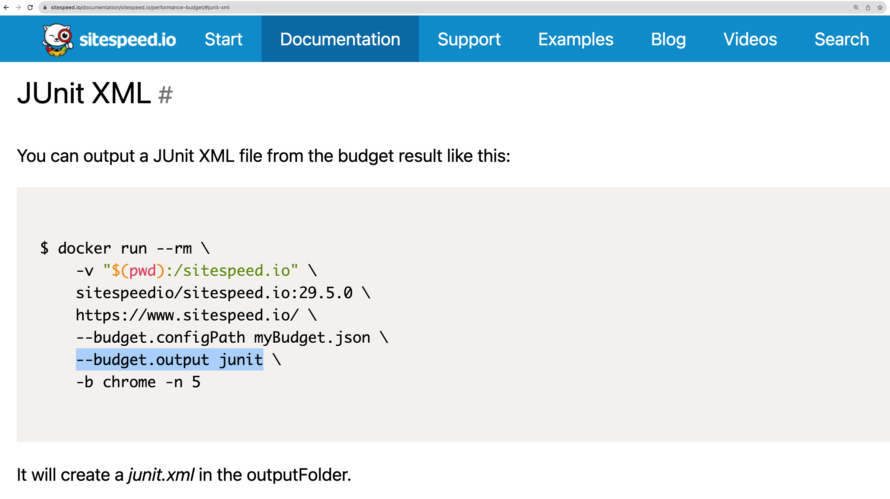

---

<!-- _class: main error -->

# SiteSpeed 29.5.0 выгружает только __статусы проверок__ в формат __JUnit-XML__ 

## 

---

<!-- _class: main -->

# __Allure__ поддерживает формат __JUnit-XML__

---

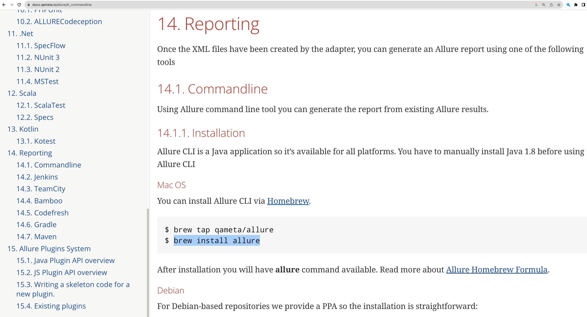

---

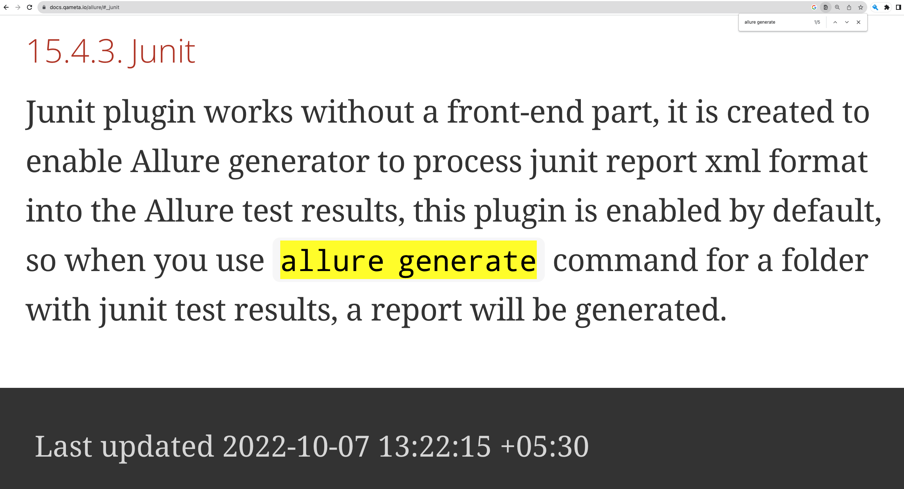

---

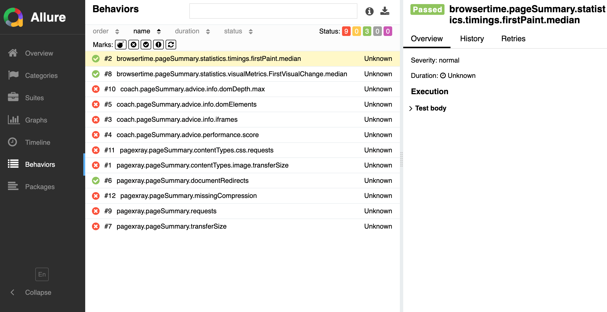

---

<!-- _class: main problem -->

# __v4.__ Как выявить __деградацию__ текущего запуска тестов по сравнению с предыдущими __визуально__?

---

<!-- _class: main -->

# __SiteSpeed__ поддерживает отправку метрик в __InfluxDB__, VictoriaMetrics, Grafana.net HTTP Metrics, Graphite

---

<!-- _class: main -->

# В __Grafana Annotation__ можно сохранять ссылки на HTML-отчеты, информацию о сборке

---

<!-- _class: main -->

# __Grafana__ поддерживает отображение метрик из TimeSeries хранилищ

---

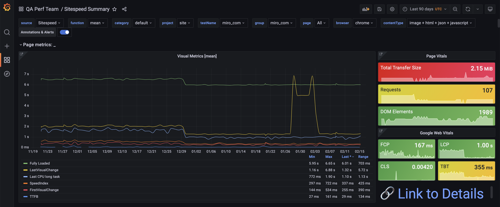

---

---

---

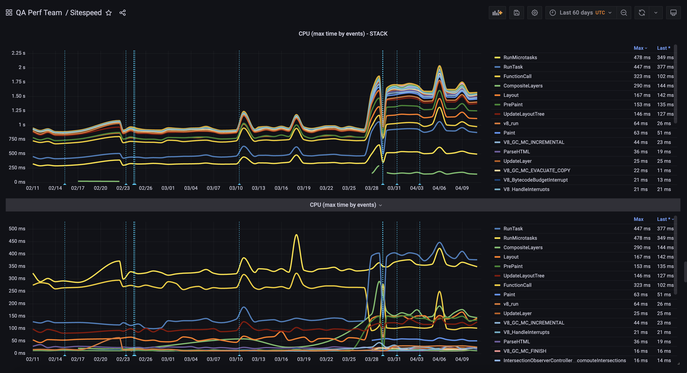

---

<!-- _class: main2  -->

# Удобно вычислять дельту между самым новым значением и минимальным значением за 3, 7, 10 дней

## для __LCP__, __Speed Index__, __Perf Score__ 

---

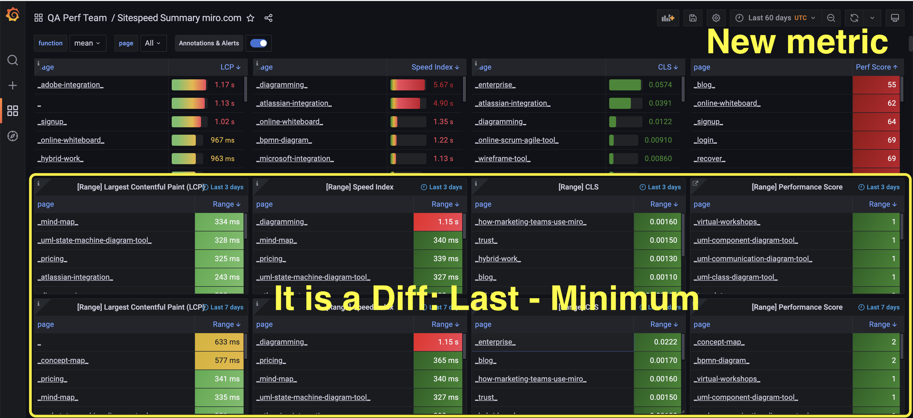

---

<!-- _class: main solution -->

# Отслеживать деградации  можно вручную  по метрикам __Grafana__, и смотреть детали в HTML-отчетах

---

<!-- _class: main problem -->

# __v5.__ Как выявить __деградацию__ текущего запуска тестов по сравнению с предыдущими __автоматически__?

---

# Пишем pipeline: __Github Action__, Jenkins, Gitlab CI, Bamboo
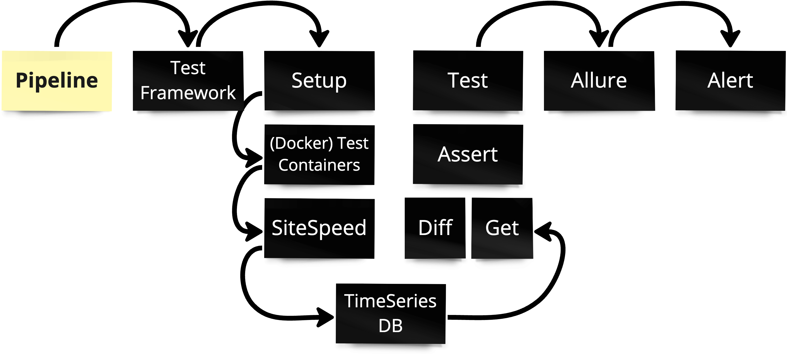

---

# Запускаем тесты: __Gradle__ + __JUnit 5__, TestNG, PyTest
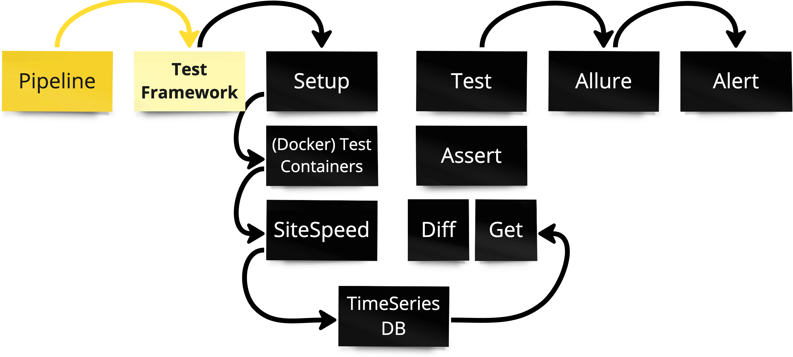

---

# В тесте есть стадии: __@Setup__ + __@Test__, @BeforeSuite + @Test

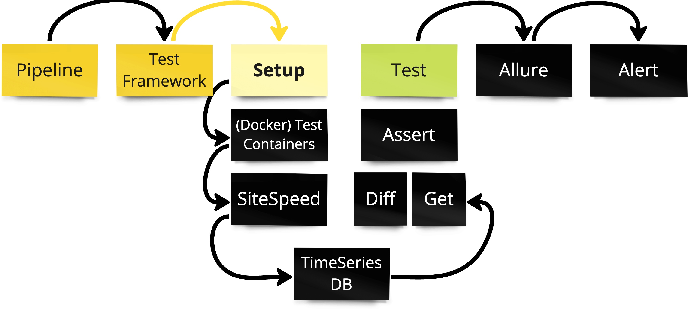

---

# В предусловии теста: __запускаем Docker__ программно

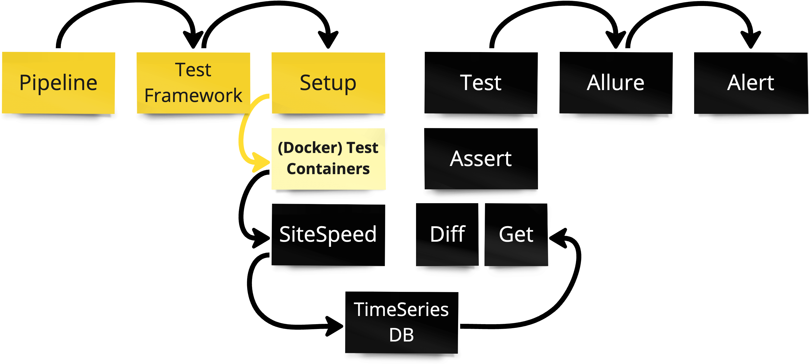

---

# В контейнере: __запуск SiteSpeed__ с параметрами

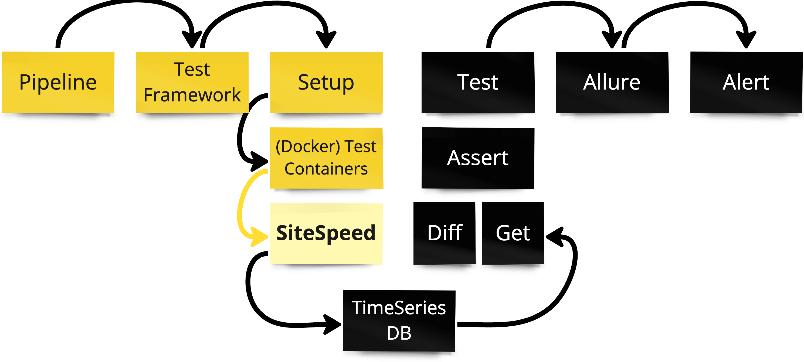

---

# SiteSpeed пишет метрики: __в VictoriaMetrics__, InfluxDB

---

# А теперь тест: __получаем__ текущие и предыдущие метрики

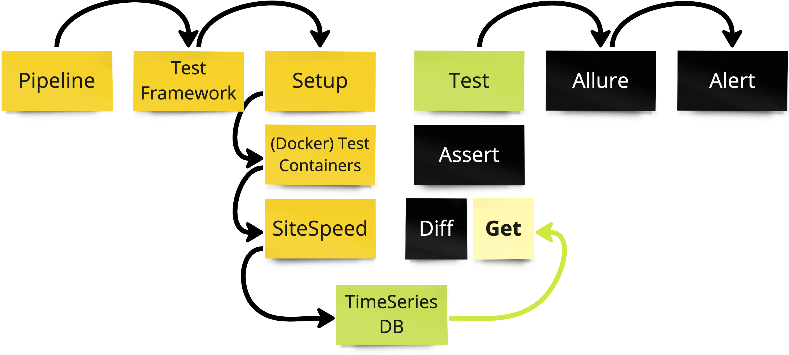

---

# А теперь тест: __сравниваем__ текущие и предыдущие метрики

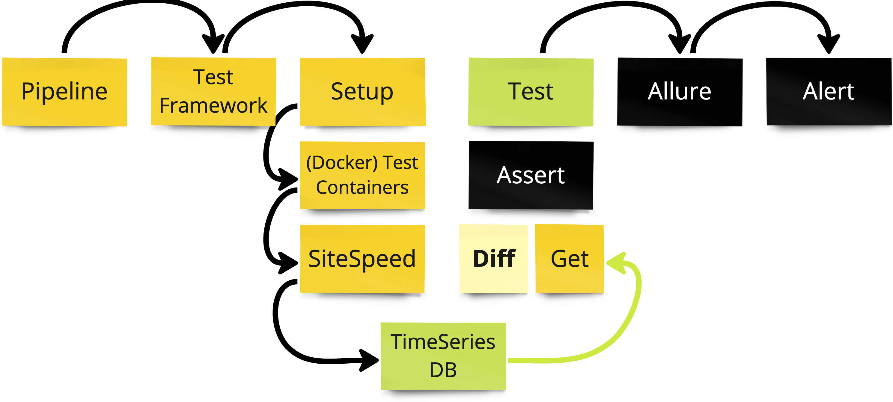

---

# А теперь тест: __проверяем разницу__ на лимиты

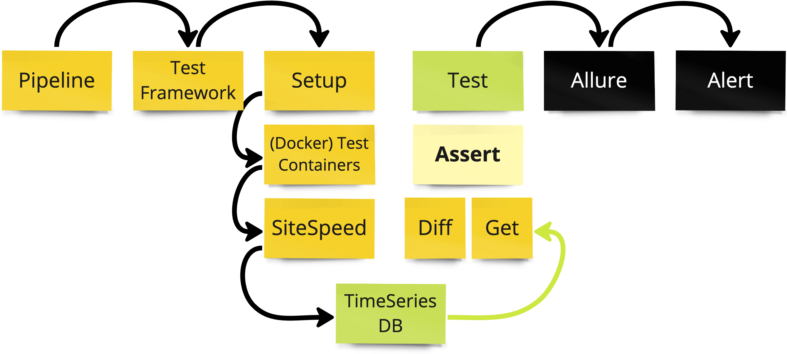

---

# Тест на метрики завершен: __метрики (не) деградировали__

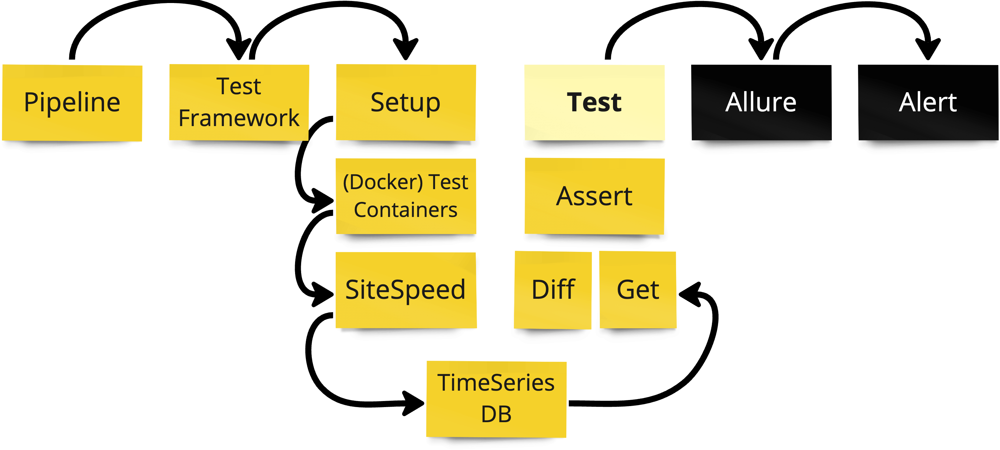

---

# Формируется отчет: __в Allure__

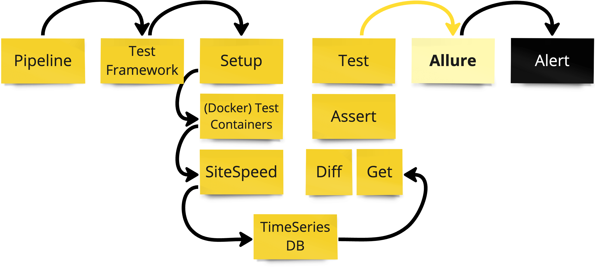

---

# Формируется уведомление: __в Slack__, __Telegram__

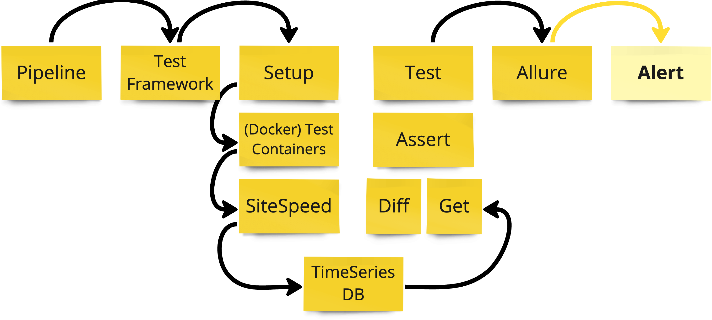

---

# Основные тесты __тестируют метрики__ из хранилища метрик

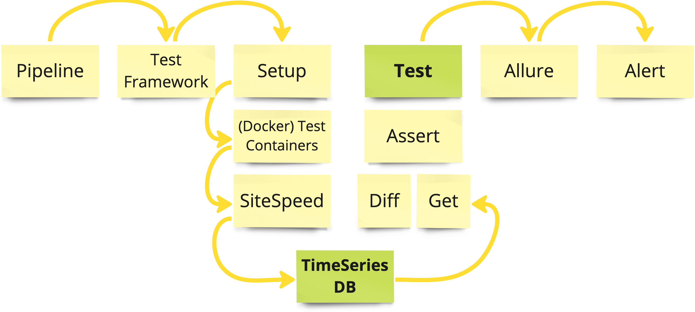

---

<!-- _class: main problem -->

# __v6.__ Как реагировать на сообщения о деградации?

---

<!-- _class: main solution -->

# Изучить детальные отчеты

---

<!-- _class: main problem -->

# Для aвтоматизации работы с камими ещё инструментами можно использовать такой подход?

---

<!-- _class: main -->

# Метрики о своей работе пишет много инструментов тестирования

---

## C __InfluxDB__, __VictoriaMetrics__ работают инструменты:

- # Apache.JMeter

- # Gatling
- # k6
- # SiteSpeed
- # __и другие__

---

<!-- _class: main solution -->

# Для многих инструментов можно применять __автоматическое__ выявление дергарадаций 

---

<!-- _class: main solution -->

# Пишите тесты на метрики, сравнивайте их во времени!

---
<!-- _class: solution -->

# __Пишите тесты на метрики__, сравнивайте их во времени!

# Пишите в  

- @__qa_load__
- @__smirnovqa__

# Примеры
- sitespeed.io
- github.com/polarnik/__sitespeed.automation__
- github.com/wikimedia/__performance-synthetic-monitoring-tests__
- github.com/wikimedia/__performance-mobile-synthetic-monitoring-tests__

# Фоны и слайды
- vlad.studio
- polarnik.github.io/sitespeed.automation

